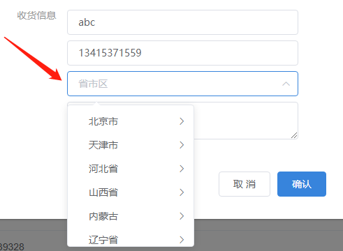
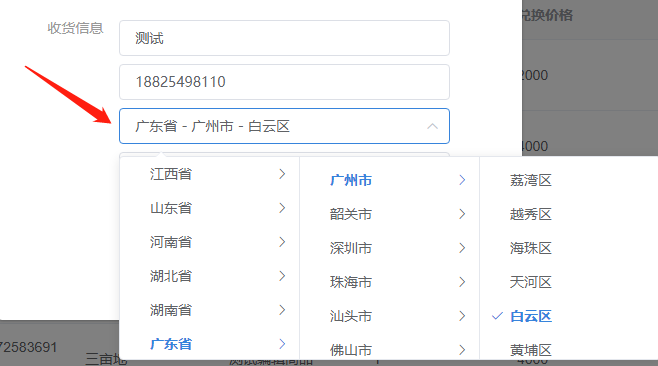

# 一个简单轻量的 省市区 选择器

## 1. 依赖

该选择器是基于 `vue2.0`、`element-ui`、`sass`的一个简单的 省市区选择器

## 2. 使用效果

### 1）表单选择

### 2）数据回显

## 3. 使用方式

1. 将DhArea文件夹复制到自己项目的 `components` 内
2. 和自定义组件的使用方式一致，具体可参考 `index.vue` 里面的实例